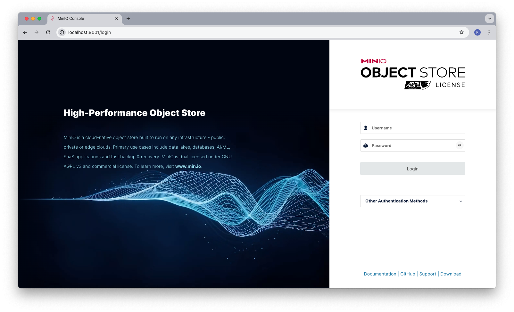
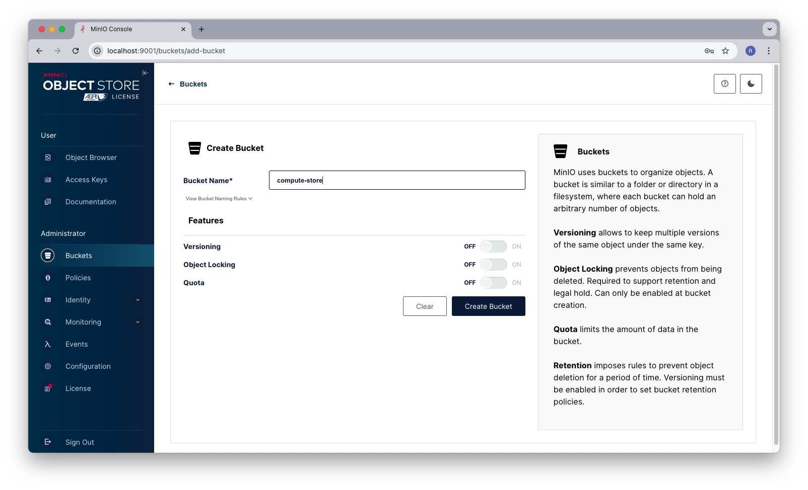
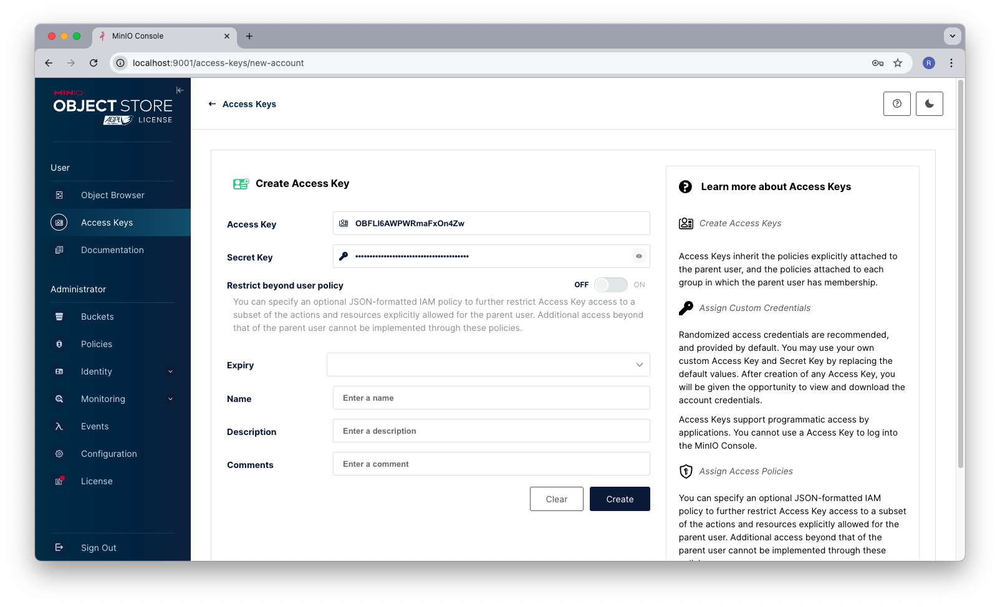
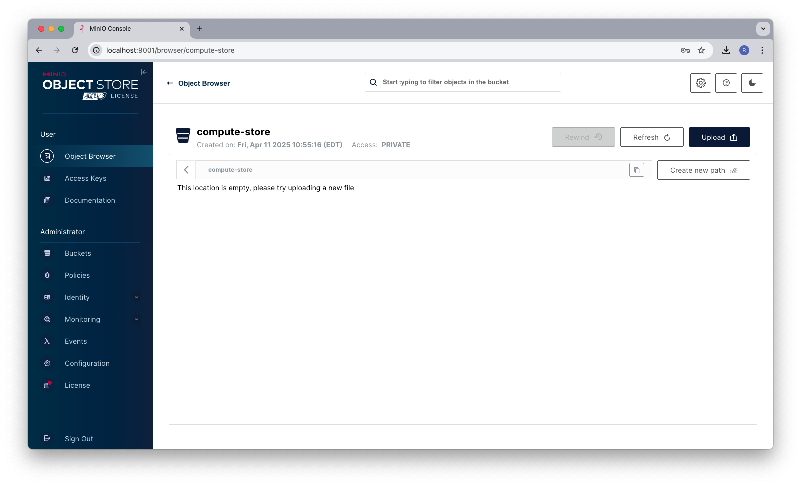
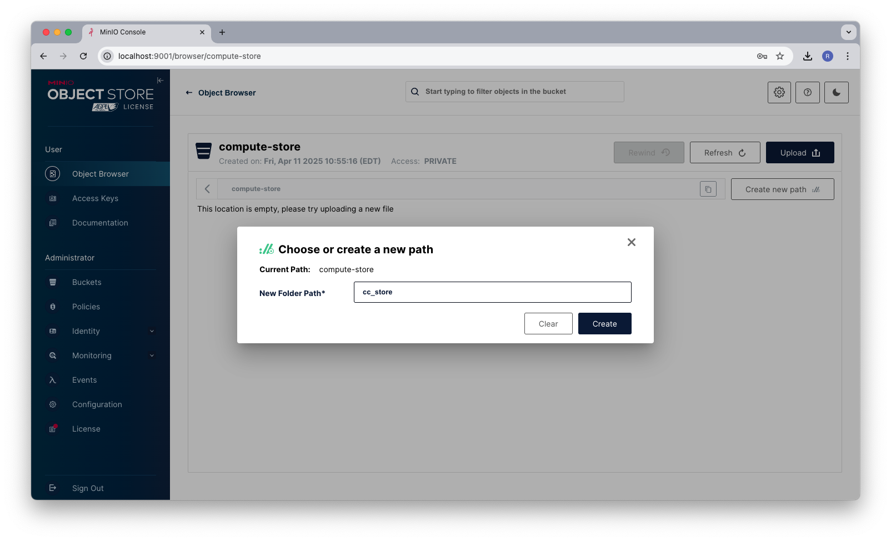
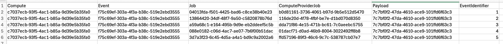

## Manifestor

Manifestor is a command line tool for registering and running computations using specified providers.
It supports Docker and AWS Batch as compute providers. 

Manifestor jobs are configured as a set of json files. At a minumum, you will need the following:

  - Compute File:  the compute file defines the job that ill be run by the manifestor.  It has the following attributes:
    - Name: the name of the job
    - Provider: the type of compute provider that will run the job
    - Plugins: the plugin manifests that are going to be run
    - Event: the list of compute manifest files that will be run in an event.

Refer to the 'data' folder for the hello-world example which runs a job using the local docker compute provider and executes a single event with two compute manifests that must be run in sequence.

``` bash
>./manifestor --envFile=.env-local-hw run data/hello-world/compute.json
```
An environment file is necessary to give the compute provider permissions to configure and copy/read payloads from a compute store.  A sample environemnt using a local instance of minio to emulate AWS S3 is:

``` bash
CC_AWS_ACCESS_KEY_ID=minioBucketIdKey
CC_AWS_SECRET_ACCESS_KEY=minioBucketSecretKey
CC_AWS_DEFAULT_REGION=us-east-1
CC_AWS_S3_BUCKET=ccstore
CC_AWS_ENDPOINT=http://localhost:9000
```

If you are running jobs that use Cloud Compute payloads, a minio bucket is neccesary to emulate the compute store.  To configure this bucket, run minio locally using the docker-compose.yml file in this repositories root directory:

``` bash
>docker compose up
```
Once minio is running, open your browser and login to minio on `http://localhost:9001` with the username and password from the docker-compose.yml file.



Select `Buckets` from the `Administrator` left panel menu and click the `Create Bucket` button.

Create a bucket similar to this:



Select `Access Keys` from the `User` left panel menu and click the `Create access key` button.

Name this key however you like and this will be the ID/Secret key used by your compute environment file.



For this example, and access key id of `OBFLI6AWPWRmaFxOn4Zw` was created with a corresponding secret of `B5Mjn5FtekP6wwBGNecnVejgyG0c9jiaGAjshNui`

Next select `Object Browser` from the `User` left panel menu, then select `compute-store` to view the objects in the store (which is currently empty).



Select the `Create new path` button to the right and create a path called `cc_store`.  This is a store used by Cloud Compute to manage payloads and other information that is transmitted to running jobs.



now create an environment file called `.env` with the keys and endpoints you just created:

``` bash
CC_AWS_ACCESS_KEY_ID=OBFLI6AWPWRmaFxOn4Zw
CC_AWS_SECRET_ACCESS_KEY=B5Mjn5FtekP6wwBGNecnVejgyG0c9jiaGAjshNui
CC_AWS_DEFAULT_REGION=us-east-1
CC_AWS_S3_BUCKET=compute-store
CC_AWS_ENDPOINT=http://localhost:9000
```

At this point you should be able to run the hello world example by executing the following:
``` bash
>./manifestor --envFile=.env --computeFile=data/hello-world/compute.json run 
```

the manifestor command has the following syntax:
> manifestor --envFile={path to env file} --computeFile={path to compute file} {command} {subcommands}

there are four possible commands to execute:
 1) **run**: the run command executes a compute job. syntax is:
    >manifestor run {optional job store}

    example:
    ```bash
    ./manifestor --envFile=.env-aws --computeFile=data/ras-sample/aws/compute.json run --jobStore=data/ras-sample/aws/jobs.csv
    ```
    This will run a compute and export the compute identifiers to a csv file **jobs.csv**  The output of the jobs file is comma separated values containing:

    

    Note that the Compute, Event, and Job Identifiers are created and used by cloud compute.  The ComputeProviderJob is the identifier natively used by the compute provider.  The payload guild represents the folder in the cloud compute store that holds the jobs payload and the event identifier is the string identifier injected into the environment for each run.

 2) **register**: registers a plugin manifest with a compute environment.
    >manifestor register 

    example:
    ```bash
    ./manifestor --envFile=.env-aws --computeFile=data/ras-sample/aws/compute.json register
    ```

 3) **terminate**: terminates jobs in the compute provider.
    >manifestor terminate {termination-level} {identifier} {termination-message}
    
    - termination-level is one of three categories to terminate jobs on: `COMPUTE|EVENT|JOB`.  This is combined with the identifier to delete a set of jobs.
    - identifier is the GUID of the compute/event/job that will be used for jobs termination.
    - termination message is the message that will be recorded by the compute probvider when jobs are terminated.

    example:
    ```bash
    ./manifestor --envFile=.env-aws --computeFile=data/ras-sample/aws/compute.json terminate COMPUTE 068ff6fe-d8d9-48af-b897-b937a7e14dae "more testing tools"
    ```
 4) **logs**: extract job logs from the compute provider.
    >manifestor logs {compute provider job identifier}
   
    - compute provider job identifier is the native identifier of the compute provider created for the job

    example:
    ```bash
    ./manifestor --envFile=.env --computeFile=data/ras-sample/aws/compute.json log 20e84f68-56dc-46fd-b5f3-c2494e4c5f83
    ```


## Notes
When running with the Docker provider, the tool will automatically register the plugin before running.
The `compute.WaitForJobs()` function is called only when using the Docker provider to ensure that all jobs complete before exiting.

For any issues or further questions, please refer to the GitHub repository or contact the support team.

#### building:
```bash
>> cd src
>> go build -o manifestor ./cmd
>> go build -ldflags="-X 'main.version=v1.0.0'" -o manifestor ./cmd
>> go build -ldflags "-X main.version=v0.9.0 -X main.commit=$(git describe --tags --always --long) -X main.date=$(date -u +%Y-%m-%dT%H:%M:%SZ)" -o manifestor ./cmd
>> go build -ldflags "-X main.version=v0.9.0 -X main.commit=$(git describe --tags --always --long) -X main.date=$(date -u +%Y-%m-%dT%H:%M:%SZ)" -o manifestor ./cmd
```
TODO
 - return new registered name from provider
 - add unregister
 - add switch to run that registers and unregisters
 - logsearch
 - 

